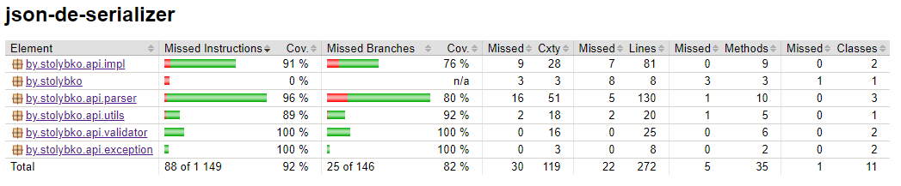

# Task
1. Создать любой gradle проект
2. Проект должен быть совместим с java 17
3. Придерживаться GitFlow: master -> develop -> feature/fix
4. Разработать библиотеку, которая будет формировать на основе Java класса json и обратно
5. Использовать рефлексию
6. Предусмотреть возможную вложенность объектов (рекурсия), смотрите приложение I
7. Покрыть код unit tests (можно использовать jackson/gson)
8. Использовать lombok

Разработанна библиотека которая парсит json в объекты и обратно используя рефлексию и рекурсию.
Пример json'а который парсит библиотека:
~~~
{
    "name": "UniverMag",
    "customers": [
        {
            "id": "1024a45d-f272-4189-a58c-fc24f2822bad",
            "firstName": "Reuben1",
            "lastName": "Martin1",
            "dateBirth": "2003-11-03",
            "orders": [
                {
                    "id": "2024a45d-f272-4189-a58c-fc24f2822bad",
                    "products": [
                        {
                            "id": "3024a45d-f272-4189-a58c-fc24f2822bac",
                            "name": "1colbasa",
                            "price": 205.6
                        },
                        {
                            "id": "4024a45d-f272-4189-a58c-fc24f2822bac",
                            "name": "1colbasa",
                            "price": 255.6
                        }
                    ],
                    "createDate": "2021-09-30T15:30:00+01:00"
                }
            ]
        },
        {
            "id": "5024a45d-f272-4189-a58c-fc24f2822bad",
            "firstName": "Reuben2",
            "lastName": "Martin2",
            "dateBirth": "1999-11-03",
            "orders": [
                {
                    "id": "2024a45d-f272-4189-a58c-fc24f2822bad",
                    "products": [
                        {
                            "id": "3024a45d-f272-4189-a58c-fc24f2822bac",
                            "name": "1colbasa",
                            "price": 205.6
                        },
                        {
                            "id": "4024a45d-f272-4189-a58c-fc24f2822bac",
                            "name": "1colbasa",
                            "price": 255.6
                        }
                    ],
                    "createDate": "2021-09-30T15:30:00+01:00"
                }
            ]
        }
    ],
    "products": [
        {
            "id": "3024a45d-f272-4189-a58c-fc24f2822bac",
            "name": "1colbasa",
            "price": 205.6
        },
        {
            "id": "4024a45d-f272-4189-a58c-fc24f2822bac",
            "name": "1colbasa",
            "price": 255.6
        }
    ]
}
~~~

Библиотека покрыта тестами:

